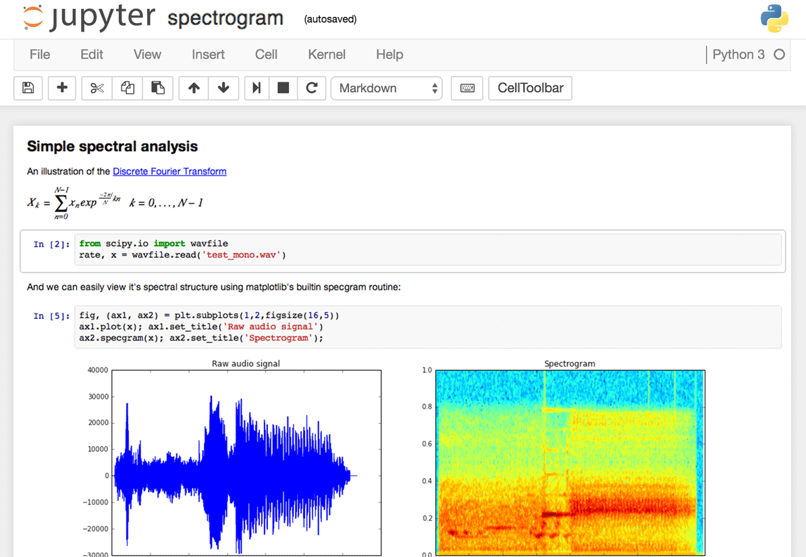

# What are Jupyter Notebooks?

Jupyter Notebooks are like interactive, code-based lab books. They make it really easy to share code with your team.
They have several advantages over sharing raw `file.py` python files:

- **Inline results** – you can display the results of a piece of code (say, a plot, a table of your data, or your results) in the notebook
- **Modularity** – you will write your code as a series of modules (little chunks of code) which make it easy to follow a sequence of steps and chunk your code and test each chunk
- **Text + Code** – you can write text in Markdown format so you can have text to explain code chunks. Very useful for sharing.

They look like this:

# Installing Jupyter Notebooks

To install Jupyter Notebooks, visit [this page from Jupyter](http://jupyter.readthedocs.io/en/latest/install.html) and follow the instructions.
Like Jupyter, we recommend using the Anaconda distribution, which will also install other key packages (like scikit-learn and the scipy stack.)

# Using Jupyter Notebooks

**We recommend the quick tutorial in the Pandas Cookbook by Julie Evans.** See the folder above this one.
But the best way to learn is to experiment.
Once you've got it installed, run `jupyter notebook` in your terminal and try:

- Importing Python libraries (say, `import numpy as np`)
- Writing functions
- Running a function and getting the output
- Printing a matrix with `numpy`
    - E.g. – `print np.random.rand(3,3)` for a 3x3 matrix drawn from the uniform distribution on (0, 1)
- Writing Markdown code (with inline LaTeX!)
- Plotting using `matplotlib` (tip: run `%matplotlib inline` and the notebook will display plots right in the notebook)

